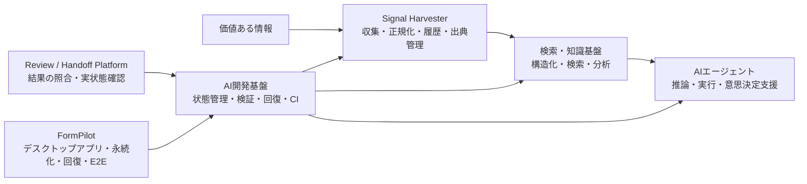

# AI Engineering Portfolio

Claude Code / Codex などのAI開発支援を使いながら、**問題設定・要件整理・設計方針・検証・受入まで自分で責任を持つ**形で開発しています。

主な関心領域は、AIエージェント、情報収集・データ基盤、検索・知識基盤、評価・可観測性、本番運用、意思決定支援です。

## 全体像

4つのプロジェクトは別々の実験ではなく、**情報を取得し、構造化し、AIが利用し、本番で安全に動かすために必要な能力を横断して試しているPortfolio**です。

## 開発スタイル

詳細な実装やレビュー支援にはClaude Code / Codexを積極的に使っています。

一方で、以下は自分の責任範囲として扱っています。

- 問題設定・要件整理
- 設計方針・受入条件の定義
- 実装タスクの分解とAIへの委譲
- 生成された差分の確認
- テスト・CI・回帰確認
- 不具合の原因切り分け
- 修正方針・受入可否の判断
- 実装結果と設計意図の整合確認

AIが生成したコードをそのまま採用するのではなく、**仕様・差分・テスト・CI・実際のシステム状態を確認してから受け入れる**ことを重視しています。

## 主要プロジェクト

| プロジェクト | 主なテーマ | 技術・設計上の要点 |
|---|---|---|
| [AI Development Foundation / Loop Engineering](projects/01_ai_development_foundation.md) | AI開発基盤・実行制御 | タスク状態、検証、回復、CI、不明時停止、AIレビュー連携 |
| [Signal Harvester](projects/02_signal_harvester.md) | 情報収集・データ基盤 | GitHub / Hacker News / RSS / Web、正規化、履歴、差分、出典管理、再現 |
| [Review / Handoff Platform](projects/03_review_handoff_platform.md) | AI実装・レビュー連携 | 入出力の紐付け、GitHub実状態確認、古い結果の拒否、結果不明時の再実行防止 |
| [FormPilot](projects/04_formpilot.md) | Windowsデスクトップアプリ | Electron / React、SQLite / PostgreSQL、実行キュー、回復、可観測性、E2E |

## 公開コードサンプル

主要プロジェクト本体は非公開ですが、実装内容を確認できるように、実際の実装から本質部分を抜き出した公開用コードを置いています。

| サンプル | 言語 | 内容 |
|---|---|---|
| [AI実装結果の安全な適用](samples/result_apply_guard.py) | Python | 対象Git Headの一致確認、変更範囲制限、状態遷移、結果不明時の再実行防止 |
| [取得証拠の検証と再現](samples/evidence_verification.js) | JavaScript | SHA-256による改ざん検知、引用位置の固定、保存済みデータからの再検証 |
| [自動処理の再試行ポリシー](samples/automation_retry_policy.ts) | TypeScript | 失敗理由、処理状態、自動再試行・手動確認の判定 |

詳細: [公開コードサンプルについて](samples/README.md)

## 実装・品質確認の例

- AI開発基盤で、レビュー実行の安全性に関するテスト **23 / 23 PASS**
- 回帰検証で **正常系1件 + 意図的な破壊ケース37件** を検証
- Signal Harvesterで、履歴・差分・取得証拠・出典情報・ネットワーク再取得なしの再検証を実装
- Review / Handoff Platformで、古いGit Head・許可範囲外の変更・不正な状態遷移を拒否
- FormPilotで、型検査 / Lint / Unit Test / Build / 認証付きElectron E2EをCIで検証

## 技術スタック

- **言語**: Python, TypeScript / JavaScript, SQL
- **アプリケーション**: Node.js, Electron, React
- **データベース**: SQLite, PostgreSQL
- **開発・品質**: Git, GitHub, GitHub Actions, Unit Test, E2E Test, Regression Test
- **AI開発支援**: Claude Code, Codex

## 開発で重視していること

### 1. 「動いた」で終わらせない
正常系だけでなく、状態不整合、結果不明、再試行、障害、権限境界、回帰まで明示的に扱います。

### 2. 後から検証できる証拠を残す
「実装した」という自己申告だけではなく、テスト、CI、PR、差分、状態遷移、外部システムの実状態などで確認できる形を残します。

### 3. AI生成コードを鵜呑みにしない
AI出力は候補実装として扱い、差分・仕様適合・テスト・CIを確認してから受け入れます。

### 4. 単発対応を再利用できる仕組みにする
その場限りの修正ではなく、共通ルール、検証処理、状態モデル、データ処理、回帰テストへ落とし込むことを意識しています。

## ソースコードについて

主要プロジェクトは非公開リポジトリで継続開発しています。

この公開Portfolioでは、**設計意図・アーキテクチャ・自分の役割・検証結果・公開可能な実装サンプル**を確認できる形にしています。

## 今後深めたい領域

**価値ある情報の収集 → 構造化 → 検索・分析 → AIエージェント → 本番運用 → 意思決定**

まで一貫して扱う、Applied AI / AI Agent / Data Intelligence / FDE領域で、本番環境での実装経験を深めたいと考えています。
