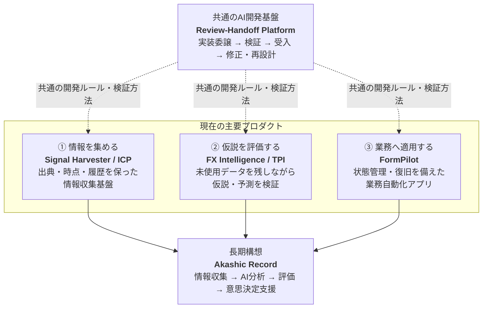

# AIプロダクト / FDE領域 ポートフォリオ

新規事業・開発PMの経験を背景に、事業や業務の課題を整理し、**AIを活用したシステムの要件定義・設計・検証・受入判断まで**を個人開発で実践しています。

コード生成・直接実装には主にCodex / ClaudeなどのCoding Agent（AI実装支援）を活用し、私は以下を担当しています。

**課題整理 → 要件定義 → システム設計 → 実装指示 → 検証設計 → レビュー → 受入 / 再設計**

---

## ポートフォリオ全体像

現在は、複雑なAIシステムに必要な要素を**「情報収集」「評価」「業務適用」**の3つに分けて検証しています。  
これらの開発を共通の**AI開発基盤**で支え、将来的には各プロダクトで得た知見を**Akashic Record**の構想へ統合します。



### 主要プロダクト

| 役割 | プロダクト | 概要 | 現在の状態 |
|---|---|---|---|
| **情報収集** | [Signal Harvester / Signal Intelligence Corpus（ICP）](projects/02_signal_harvester.md) | Web・GitHub等から情報を収集し、出典・取得時点・履歴・差分を保持する | **主要機能を実装済み / 観測範囲を拡張中** |
| **評価** | [FX Intelligence / Temporal Pattern Intelligence（TPI）](projects/03_fx_intelligence.md) | USD/JPYデータを用い、仮説・予測を未使用データを残しながら検証する | **研究・評価基盤を実装済み** |
| **業務適用** | [FormPilot](projects/04_formpilot.md) | Webフォーム業務の自動化に向け、状態管理・復旧・安全な実行境界を設計する | **基盤・観測機能を実装済み / 自動実行機能を開発中** |
| **共通基盤** | [AI開発基盤 / Review-Handoff Platform（RHP）](projects/01_ai_development_foundation.md) | Coding Agentへ実装を委譲し、実状態を確認して受入・再設計する開発基盤 | **主要機能を実装済み / 自動実行範囲は一部制限** |
| **長期構想** | [Akashic Record](vision/akashic-record.md) | 各プロダクトの知見を、複数AIによる分析・評価・意思決定支援へ統合する | **設計段階** |

---

## 主な経験領域

| 領域 | 取り組んでいること | 主な関連プロダクト |
|---|---|---|
| **課題整理・要件定義** | 曖昧な事業・業務課題を、実装可能な要件と受入条件まで整理する | 全プロダクト |
| **AI支援開発の設計・進行管理** | Coding Agentへの実装委譲からレビュー・検証・受入までを一つの工程として管理する | AI開発基盤 |
| **状態・権限・進行条件の設計** | 誰が・いつ・何を実行できるかを明確にし、誤った進行や二重実行を防ぐ | AI開発基盤 / FormPilot |
| **評価・受入判断** | テスト・独立レビュー・実状態確認を組み合わせて結果を判断する | AI開発基盤 / FX Intelligence / FormPilot |
| **根拠・出典管理** | 判断に使った情報を、出典・取得時点・履歴とともに残す | Signal Harvester / FX Intelligence |
| **失敗時の復旧設計** | 中断・失敗・結果不明が起きても、安全に再開・修正できるようにする | AI開発基盤 / FormPilot |
| **時点・履歴管理** | 「いつ時点の情報か」を保持し、過去と現在を混同しないようにする | Signal Harvester / FX Intelligence |
| **実験・検証設計** | 仮説・評価条件・未使用データを分け、結果観測後の評価汚染を防ぐ | FX Intelligence |

→ **[能力とプロダクトの対応を詳しく見る](capabilities/README.md)**

---

## 今後深める領域

現在の個人開発では、以下は一部実践または設計段階です。

- 複数AIが独立して分析し、異なる仮説を比較する仕組み
- AI同士が互いの結果を批評・反証する仕組み
- 問題に応じて利用するAI / モデルを切り替える仕組み
- 品質・速度・コストを考慮したAI / モデル選択
- 複数の評価結果を組み合わせた選択・判定
- 信頼度・不確実性の高度な評価

**実装・検証済みの範囲と、今後深める領域を分けて記載しています。**

---

## プロダクト間で知見を横展開する開発プロセス

各プロダクトで見つかった問題を個別修正で終わらせず、共通ルールとして他の開発にも反映しています。

```text
問題・不具合を検知
      ↓
原因を分析
      ↓
設計原則・確認ルールへ変換
      ↓
共通基盤や回帰テストへ反映
      ↓
他プロダクトにも適用
```

### 代表的な検証・改善事例

- **[AIが成功を報告したが、実際には変更が反映されていなかった](case-studies/01_readback_failure.md)**  
  → AIの実行結果だけで完了判定せず、実際のファイル状態を確認して受入する仕組みへ変更

- **[自動テスト通過後のレビューで重大な問題が見つかった](case-studies/02_green_ci_independent_review.md)**  
  → CIの結果だけを最終判断にせず、独立レビューと再設計を開発工程へ追加

- **[結果観測後の条件変更によって評価が歪むリスク](case-studies/03_experiment_contamination.md)**  
  → 未使用データと評価条件を事前に固定し、実験結果の汚染を防止

---

## 公開している実装サンプル

主要プロダクト本体は非公開リポジトリで継続開発しています。公開側では、設計・制御ロジックを確認できるよう、依存関係を減らした実装サンプルとテストを掲載しています。

- [AI実装結果を安全に適用する仕組み — Python](samples/result_apply_guard.py)
- [取得した情報の根拠を再検証する仕組み — JavaScript](samples/evidence_verification.js)
- [自動処理の再試行可否を判断する仕組み — TypeScript](samples/automation_retry_policy.ts)

コード生成・直接実装にはCoding Agentを活用し、私は**要件・設計・テスト観点・レビュー・受入判断**を担当しています。

### 個人開発で利用している実装環境

Python / TypeScript / JavaScript / Node.js / Electron / React / SQLite / PostgreSQL / Git / GitHub / CI / Unit Test / E2E / Regression Test

※上記は個人開発で利用している実装環境であり、手書き実装スキルの一覧ではありません。
