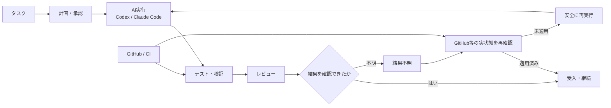

# AI Development Foundation / Loop Engineering

## 概要

複数のAI開発タスクを、途中終了・状態不明・再実行・レビュー漏れなどに強い形で進めるための共通開発基盤です。

単にAIへ依頼を投げるのではなく、

**タスク → 計画・承認 → AI実行 → 検証 → レビュー → 結果確認 → 回復・継続**

を明示的な状態として扱い、AIが途中で終了した場合や結果が不確実な場合でも、安全に再開できることを重視しています。

## 全体像

AI実行そのものよりも、**状態・証拠・検証・回復を含む実行ループ全体**を設計対象にしています。

## 解きたかった問題

AIに実装を任せると、単純なコード生成以外に次の問題が起きます。

- 実行途中で止まり、どこまで完了したか分からない
- AIが「完了」と答えてもGitHub側の実状態と一致しない
- 古いRevisionに対するレビュー結果を誤って現在の結果として扱う
- 書き込み結果が不明なまま再実行して二重変更する
- 本来変更してはいけないファイルまで修正対象が広がる

そこで、**AIの発言ではなく外部システムの実状態を基準に完了を判断する**方向へ設計を寄せています。

## 代表的な設計判断

### 1. 対象Revisionを固定する

AIへ渡したタスクとGit Headを紐付け、結果を適用する直前にも現在Headを確認します。Headが動いていた場合は、古い結果をそのまま適用しません。

### 2. 変更可能な範囲を先に決める

タスクごとに変更可能なファイル範囲を持たせ、結果に範囲外の変更が含まれていた場合は止めます。

### 3. 結果不明を成功・失敗へ丸めない

書き込み要求後に応答が失われた場合などは「結果不明」として扱います。この状態では再実行せず、GitHub側の状態を確認してから次の処理を決めます。

### 4. 終了状態は実状態確認から確定する

「適用済み」「未適用」といった最終状態を、AIや実行処理の自己申告だけでは直接設定できないようにしています。

## 主な実装テーマ

- タスク・実行単位の状態管理
- 実行制御
- テスト・回帰検証
- 再試行・回復・継続
- 古い結果の検知
- GitHub連携
- AIレビュー連携
- 不明な場合は処理を止める安全設計
- CIによる継続検証
- 共通スキル・共通ルール化

## 実装・検証の例

- レビュー実行の安全性に関するテスト: **23 / 23 PASS**
- 回帰検証: **正常系1件 + 意図的な破壊ケース37件**
- GitHub Actionsで基盤・実行系の処理を継続検証
- 対象RevisionとCI結果を紐付け、古い結果を現在の証拠として扱わない
- 結果不明時に状態確認なしで再実行しない
- 承認・実行・完了判定の責任範囲を分離

## 公開コードで確認できること

- [Python: AI実装結果の安全な適用](../samples/result_apply_guard.py)
- [Python: テスト](../samples/test_result_apply_guard.py)

公開版では、実プロジェクトの考え方を小さく切り出し、次の動作を読める形にしています。

- Git Headが一致しなければ停止
- 許可範囲外の変更を拒否
- 不正な状態遷移を拒否
- 結果不明のまま再実行しない
- 実状態確認後にのみ適用済み・未適用を確定

## 私の役割

- 開発運用上の問題定義
- 要件・状態モデル・安全境界の設計
- Codex / Claude Codeへの詳細実装委譲
- 実装差分の確認
- テスト・回帰観点の追加
- CI / GitHub実状態の確認
- 不具合原因の切り分け
- 修正方針と受入可否の判断

## このプロジェクトで示したいこと

AIエージェントを実運用する場合、モデル性能だけでなく、**状態・権限・再試行・回復・検証可能な証拠・可観測性**まで含めて設計する必要があると考えています。
