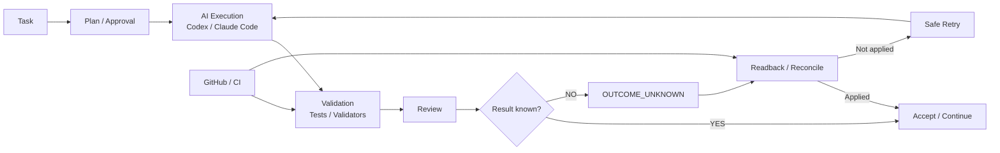

# AI Development Foundation / Loop Engineering

## 概要

複数のAI開発タスクを、途中終了・状態不明・再実行・レビュー漏れなどに強い形で進めるためのAI開発共通基盤 / Loop Runtimeです。

単にAIへ依頼を投げるのではなく、

**Task → Plan / Approval → Execution → Validation → Review → Result → Recovery / Continuation**

を明示的な状態として扱い、AIが途中で終了した場合や結果が不確実な場合でも、安全に再開できることを重視しています。

## Architecture

このProjectでは、AI実行そのものよりも、**状態・証拠・検証・回復を含む実行ループ全体**を設計対象にしています。

## 主なテーマ

- Task / Run state
- execution control
- validation / regression
- retry / recovery / continuation
- stale result detection
- GitHub integration
- review orchestration
- fail-closed safety
- CIによる継続検証
- reusable Skill / Contract化

## Representative Evidence

- review executor safety bindingのtargeted tests: **23 / 23 PASS**
- Validation regression: **1 positive baseline + 37 negative mutations**
- GitHub ActionsでFoundation / Runtime系workflowを継続検証
- exact revisionとCI結果をbindingし、古い結果を現在HeadのEvidenceとして扱わない設計
- `OUTCOME_UNKNOWN`時のblind retry抑止
- authority / approval / executionを分離したstate boundary

## 私の役割

- 開発運用上の問題定義
- 要件・状態モデル・安全境界の設計
- Codex / Claude Codeへの詳細実装委譲
- 実装差分の確認
- test / regression観点の追加
- CI / GitHub stateのreadback
- failure root causeの切り分け
- 修正方針と受入可否の判断

## このProjectで示したいこと

AIエージェントを実運用する場合、モデル性能だけでなく、**状態・権限・再試行・回復・Evidence・検証・可観測性**が重要だと考えています。
