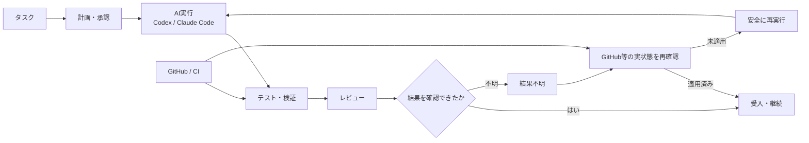

# AI Development Foundation / Loop Engineering

## 概要

複数のAI開発タスクを、途中終了・状態不明・再実行・レビュー漏れなどに強い形で進めるための共通開発基盤です。

単にAIへ依頼を投げるのではなく、

**タスク → 計画・承認 → AI実行 → 検証 → レビュー → 結果確認 → 回復・継続**

を明示的な状態として扱い、AIが途中で終了した場合や結果が不確実な場合でも、安全に再開できることを重視しています。

## 全体像

AI実行そのものよりも、**状態・証拠・検証・回復を含む実行ループ全体**を設計対象にしています。

## 主な実装テーマ

- タスク・実行単位の状態管理
- 実行制御
- テスト・回帰検証
- 再試行・回復・継続
- 古い結果の検知
- GitHub連携
- AIレビュー連携
- 不明な場合は処理を止める安全設計
- CIによる継続検証
- 共通スキル・共通ルール化

## 実装・検証の例

- レビュー実行の安全性に関するテスト: **23 / 23 PASS**
- 回帰検証: **正常系1件 + 意図的な破壊ケース37件**
- GitHub Actionsで基盤・実行系の処理を継続検証
- 対象RevisionとCI結果を紐付け、古い結果を現在の証拠として扱わない
- 結果不明時に状態確認なしで再実行しない
- 承認・実行・完了判定の責任範囲を分離

## 公開コード

[AI実装結果の安全な適用サンプル](../samples/result_apply_guard.py)

実プロジェクトで使っている、対象Git Headの一致確認・変更範囲制限・状態遷移・結果不明時の再実行防止を単純化して公開しています。

## 私の役割

- 開発運用上の問題定義
- 要件・状態モデル・安全境界の設計
- Codex / Claude Codeへの詳細実装委譲
- 実装差分の確認
- テスト・回帰観点の追加
- CI / GitHub実状態の確認
- 不具合原因の切り分け
- 修正方針と受入可否の判断

## このプロジェクトで示したいこと

AIエージェントを実運用する場合、モデル性能だけでなく、**状態・権限・再試行・回復・検証可能な証拠・可観測性**が重要だと考えています。
