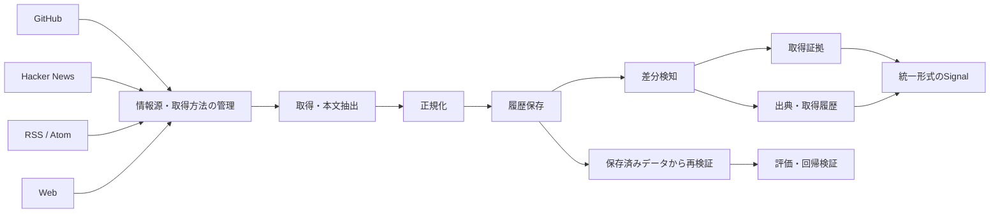

# Signal Harvester

## 概要

GitHub / Hacker News / RSS / Webなど複数の情報源から情報を取得し、**履歴・差分・取得証拠・出典情報を保持しながら再現可能に扱う情報収集基盤**です。

**情報源 → 取得 → 正規化 → 履歴保存 → 差分検知 → 取得証拠・出典管理 → 統一形式のSignal → 再検証**

という流れを重視しています。

## 全体像

単なる収集ではなく、**後から「何を・いつ・どの情報源・取得方法から得たか」を再構成できること**を重視しています。

## 主な実装

- GitHub / Hacker Newsの観測
- RSS 2.0 / Atom 1.0
- 条件付きWeb取得
- 情報源の登録・管理
- 情報源と取得手段の分離
- 正規化データの保存
- 実行履歴
- 差分優先の比較
- 改変されない取得証拠
- 出典・取得履歴の保存
- Signal識別子のVersion管理
- ネットワークへ再アクセスしない再検証
- fixture / mockを使った回帰テスト

## 設計上のポイント

### 取得証拠・出典情報
「どこから取得したか」「どの方法・時点で取得したか」を後から追跡できるようにしています。

### 再検証
保存済みの取得結果を利用し、ネットワークへ再アクセスせずに評価・再現できる構造にしています。

### 情報源と取得方法の分離
情報源そのものと取得手段を分離し、取得方法が変わってもSignalの識別を安易に壊さない設計にしています。

### 不明時は取得しない
利用条件や取得可否を確認できない場合に、自動でLive取得へ進まない安全側の設計です。

## 公開コード

[取得証拠の検証と再現サンプル](../samples/evidence_verification.js)

実装しているSHA-256による本文固定、引用位置の検証、改ざん検知、保存済みデータからの再検証を単純化して公開しています。

## 私の役割

- 製品要件・仕様設計
- データ形式・識別子・出典管理方針の設計
- 実装タスクの分解
- AI支援による実装
- テスト・回帰・再検証観点の設計
- 差分・CI・動作確認
- 仕様と実装の不一致修正

## このプロジェクトで示したいこと

単純なCrawlerではなく、**データ処理基盤・統一形式化・時間情報・出典管理・評価可能なデータ**を意識して設計・実装しています。
