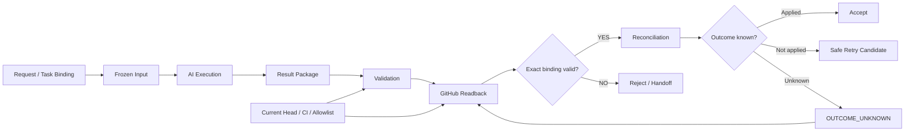

# Review / Handoff Platform

## 概要

AIが実装・レビューを担当する際に、**「何のTaskに対する、どの入力から、どの結果が返ってきたか」**を安全に追跡するための基盤です。

**Request → Frozen Input → AI Execution → Result Package → GitHub Readback → Reconciliation → Apply / Reject / Handoff**

のbindingを明示し、AIの自己申告だけで完了扱いしない設計にしています。

## Architecture

AIの出力そのものではなく、**GitHub上の実状態・対象Revision・CI・許可された変更範囲まで照合して結果を確定する**ことを重視しています。

## 主な実装テーマ

- Repository / Task binding
- deterministic input / result identity
- GitHub Result Readback
- stale / mismatched evidence detection
- result apply contract
- current-Head verification
- allowlist based file boundary
- `OUTCOME_UNKNOWN`
- no blind retry
- fail-closed reconciliation
- CI on multiple environments

## Representative Evidence

- Ubuntu CI: PASS
- Windows CI: PASS
- full unittest suite: PASS
- `python -m compileall`: PASS
- stale Head / allowlist escape / invalid state transitionをfail-closedで拒否
- 結果が不明な場合、直接Readbackするまでblind retryしない

## 私の役割

- 実運用で発生したhandoff gapの定義
- result / authority / lifecycle contract設計
- AI-assisted implementation
- negative test観点の設計
- review findingの分析
- fail-open箇所の修正方針決定
- GitHub / CI readbackによる受入判断

## このProjectで示したいこと

AIエージェントをSoftware Deliveryへ組み込む際には、**モデルが「成功」と答えたかではなく、外部Systemの実状態をreadbackして結果を確定する**ことが重要だと考えています。
