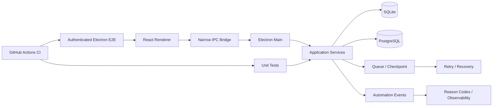

# FormPilot

## 概要

Windows向けDesktop Applicationとして、入力データ、Campaign設定、実行Queue、Retry / Recovery、Observabilityを段階的に実装しているProjectです。

## Architecture

Desktop UIだけでなく、**Local Persistence・Authentication・State・Recovery・Observability・E2Eまで含むSoftware Delivery**を扱っています。

## 技術

- TypeScript
- Electron
- React
- SQLite
- PostgreSQL
- pnpm
- GitHub Actions

## 実装済みの主な領域

- Electron sandbox / narrow IPC bridge
- SQLite migration
- campaign / target persistence
- crash-safe queue / recovery foundation
- workspace authentication / role boundary
- sender profile / template version
- campaign settings
- pacing / test mode
- Automation Event
- Reason Code
- retry-safety integration
- authenticated Electron E2E

## Verification

Phase 4ではGitHub Actions上で、以下を確認しています。

- Governance: PASS
- Typecheck: PASS
- Lint: PASS
- Unit tests: PASS
- Build: PASS
- Authenticated Electron E2E: PASS

Phase 5Aでは、以下を追加しています。

- local SQLite event persistence
- deterministic ordering
- multiple-attempt history
- Reason Code taxonomy
- atomic terminal-event state handling
- 関連check PASS

## 私の役割

- Product requirements / phase設計
- Screen / state / persistence要件
- AI-assisted implementation
- migration / authorization / recovery観点の確認
- unit / E2E / CIの受入
- regression riskの確認
- Phase単位でのscope control

## このProjectで示したいこと

Web APIだけでなく、**Desktop Application / Local Persistence / Authentication / State / Recovery / E2E**を含むSoftware DeliveryもAI支援型で進めています。
