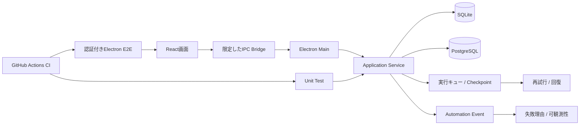

# FormPilot

## 概要

Windows向けデスクトップアプリとして、入力データ、Campaign設定、実行キュー、再試行・回復、可観測性を段階的に実装しているプロジェクトです。

## 全体像

画面だけでなく、**Local保存・認証・状態管理・回復・可観測性・E2Eまで含むSoftware Delivery**を扱っています。

## 技術

- TypeScript
- Electron
- React
- SQLite
- PostgreSQL
- pnpm
- GitHub Actions

## 実装済みの主な領域

- Electron sandbox / 限定したIPC bridge
- SQLite migration
- campaign / targetの永続化
- crash-safeな実行キュー・回復基盤
- workspace認証・権限境界
- sender profile / template version
- campaign settings
- pacing / test mode
- 自動処理イベント
- 失敗理由コード
- 再試行安全性の判定
- 認証付きElectron E2E

## 検証

Phase 4ではGitHub Actions上で以下を確認しています。

- Governance: PASS
- Typecheck: PASS
- Lint: PASS
- Unit tests: PASS
- Build: PASS
- 認証付きElectron E2E: PASS

Phase 5Aでは以下を追加しています。

- SQLiteへの自動処理イベント保存
- 決定的な並び順
- 複数試行の履歴
- 失敗理由の分類
- 終端イベントと関連状態のatomicな保存
- 関連check PASS

## 公開コード

[自動処理の再試行ポリシー](../samples/automation_retry_policy.ts)

実プロジェクトで使っているCheckpoint・失敗理由・自動再試行可否の考え方を、依存関係を減らして公開しています。

## 私の役割

- 製品要件・Phase設計
- 画面・状態・永続化要件の整理
- AI支援による実装
- migration / authorization / recovery観点の確認
- unit / E2E / CIの受入
- 回帰リスクの確認
- Phase単位でのscope control

## このプロジェクトで示したいこと

Web APIだけでなく、**デスクトップアプリ・Local保存・認証・状態管理・回復・E2E**を含むSoftware DeliveryもAI支援型で進めています。
